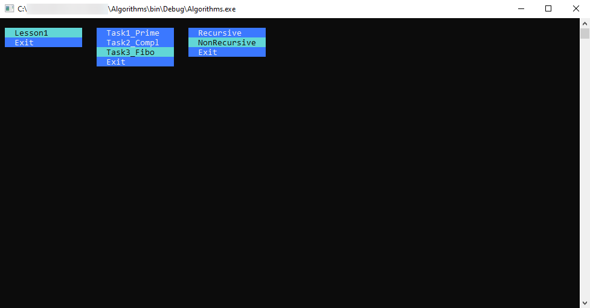

This is JackenQuake repository.
Synchronized with GitHub.

## Общая структура для курса.

Указано, что все задания по курсу должны бюыть сделаны в рамках одной программы,
с возможностью выбора программы на усмотрение разработчика. Мною была реализована
вспомогательная система меню (представленная на скриншоте).

Программа автоматически "подхватывает" новые уроки, реализованные как классы в C#, 
при условии их правильного наименования **Lesson#_Task#**. Каждый класс, кроме 
того, может иметь несколько точек входа, называемых, следуя традиции C++/C#, 
**Main_#**. Таким образом основная "рамочная" программа предлагает последовательно
в 3х меню выборать: урок -> задание (внутри урока) -> точку входа (внутри задания).